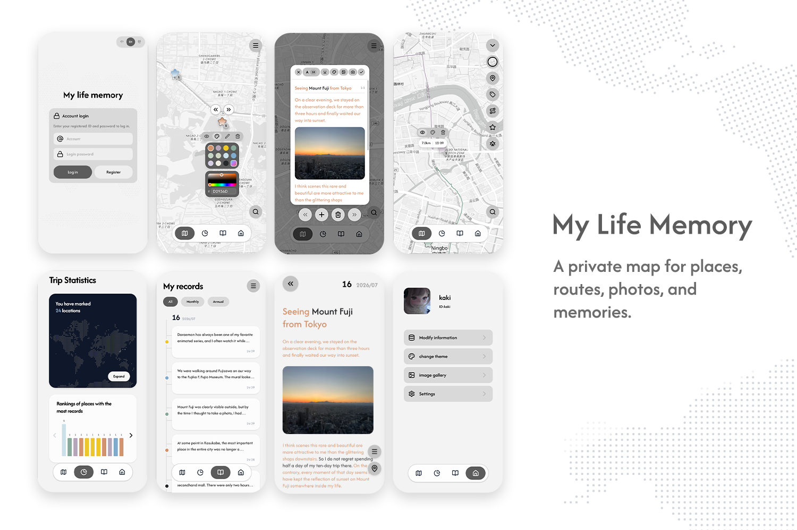
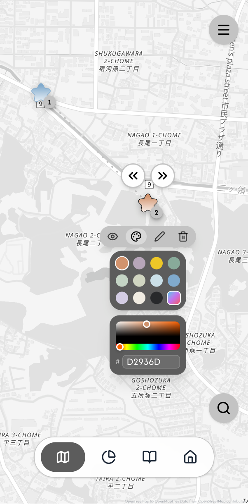
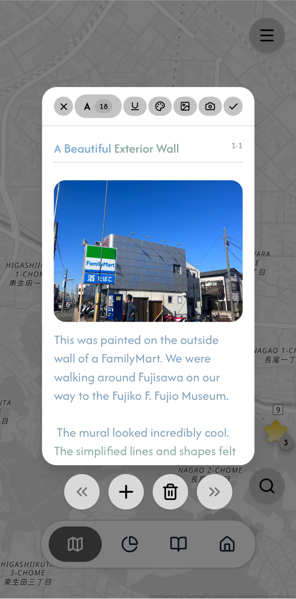
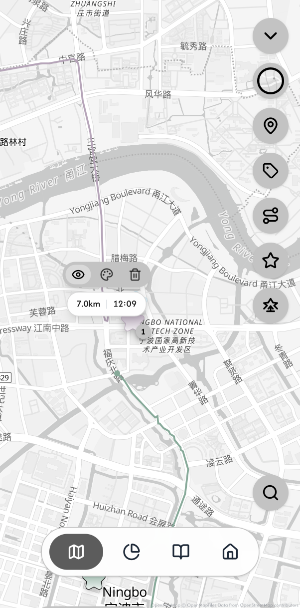
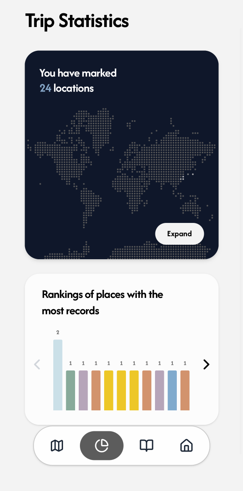
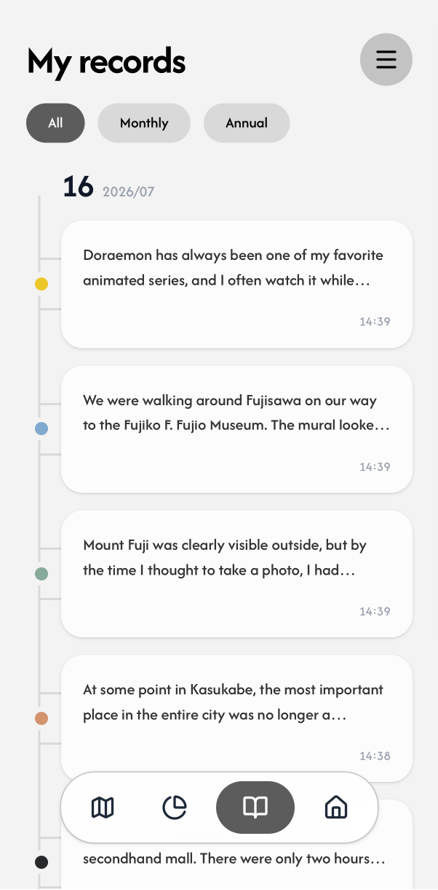

<div align="center">
  <h1>My Life Memory</h1>
  <p>My Life Memory is a private life-map app for saving places, notes, photos, routes, coordinates, and travel statistics in one personal memory space, with optional read-only MCP access.</p>
</div>

---

## Screenshots

The six views below follow the app's core journey: shape places with stars, preserve memories in text and photos, record movement, and revisit the patterns and moments that emerge.

<table>
  <tr>
    <td width="33%" align="center" valign="top">
      <br><br>
      <strong>Star color</strong><br>
      <sub>Place memories on the map and give each star its own visual identity.</sub>
    </td>
    <td width="33%" align="center" valign="top">
      <br><br>
      <strong>Memory note</strong><br>
      <sub>Combine a place with rich text, photos, color, size, and underline.</sub>
    </td>
    <td width="33%" align="center" valign="top">
      <br><br>
      <strong>Route tracking</strong><br>
      <sub>Record real movement and revisit distance, duration, and route shape.</sub>
    </td>
  </tr>
  <tr>
    <td width="33%" align="center" valign="top">
      <br><br>
      <strong>Trip statistics</strong><br>
      <sub>Turn stars and routes into location counts, rankings, and travel patterns.</sub>
    </td>
    <td width="33%" align="center" valign="top">
      <br><br>
      <strong>My records</strong><br>
      <sub>Revisit saved notes as a dated timeline with monthly and annual views.</sub>
    </td>
    <td width="33%" align="center" valign="top">
      <br><br>
      <strong>Memory reader</strong><br>
      <sub>Revisit a saved place through writing, photography, and its original date.</sub>
    </td>
  </tr>
</table>

## Features

- Place stars for meaningful locations by tapping the map, dragging the star tool, or importing the GPS metadata from one original photo.
- Tap a star to center it on the map, edit its notes, view and copy coordinates, or choose Apple Maps, AMap, Baidu Maps, or Google Maps for native map handoff.
- Write rich notes with text color, font size, underline, photos, camera capture, direct full-screen editing, and saved creation timestamps.
- Browse records by timeline, month/year filters, calendar markers, and a dedicated search results page that lists every matching note with match counts.
- Track adaptive movement routes, view route statistics, location rankings, star-colored bar charts, and a dotted world-map overview.
- Switch between Chinese, English, and Korean, customize the theme palette, and manage saved photos through the private image gallery.
- Review the privacy notice, change the account password without storing readable passwords in app state, or permanently delete the account and its private media.
- Open the in-app user manual for map, record, statistics, account, icon, and permission behavior.
- Connect an optional personal read-only MCP to compatible AI clients for evidence-based memory research across countries, cities, towns, villages, neighbourhoods, dates, routes, and note history. Vision-capable clients can request only the relevant private photos as standard MCP image content; other clients continue with text and metadata.
- Export all memories or a selected date range as a readable HTML report with note text, dates, coordinates, and embedded images instead of raw app-state JSON.
- Sync each user's settings, stars, notes, and routes through separate RLS-protected rows instead of replacing one account-wide JSON document.
- Persist entity mutations to an IndexedDB outbox before network requests, commit them atomically with optimistic dataset revisions, and retain conflict copies for notes, star locations, routes, and profile metadata.
- Soft-delete memories, retain the latest 20 historical versions per entity, and protect media referenced by active rows, deleted rows, history, conflicts, or pending local work.

## OpenAI Build Week

My Life Memory existed before OpenAI Build Week, with its core map, place stars, memory notes, route recording, and foundational interface already in place.

All visual design, UI/UX, interaction design, and product direction were created independently by me. I also made the feature decisions and led testing and acceptance. Codex was used under my direction for implementation, refactoring, debugging, testing, and documentation; the week's focus included normalized user-scoped storage, synchronization and conflict handling, the private media lifecycle, account lifecycle and privacy safeguards, the Memory API, and a read-only MCP service for MCP-compatible AI clients, including clients powered by GPT-5.6.

GPT-5.6 helped translate my completed visual and interaction designs into frontend code, assisting with React and TypeScript structure and implementation. I defined the interaction logic and component behavior, and I also participated directly in debugging, testing, and iteration. On the backend, GPT-5.6 helped design and configure Supabase, including the data model, Row Level Security policies, Edge Functions, privacy safeguards, testing strategy, and deployment workflow. Through computer-use assistance, it also helped configure and verify parts of the Supabase setup. It additionally supported product review and preparation of the competition demo materials. GPT-5.6 is not built into the web application; compatible AI clients can instead connect through the project's read-only MCP.

## Tech Stack

- React 19 + TypeScript
- Vite 6
- Tailwind CSS 4
- Leaflet + React Leaflet + MapLibre GL JS
- Motion for small UI transitions
- Supabase Auth, Postgres, Row Level Security, and private Storage
- Supabase Edge Functions for invite registration, the Memory API, MCP token management, cloud MCP, account deletion, and scheduled media retention
- Local Model Context Protocol (MCP) server for AI clients
- GitHub Pages for static hosting

## Map Data And Tile Services

- Light and dark styles use OpenFreeMap vector maps rendered with MapLibre GL JS through the Leaflet compatibility layer.
- OpenFreeMap styles use OpenMapTiles schema and OpenStreetMap data. Required source and licence links remain visible.
- The aerial style uses the public VersaTiles Satellite style, which combines openly available satellite imagery with higher-resolution public orthophotos where coverage exists.
- VersaTiles requires no account or API key. Its official imagery-source link and OpenStreetMap attribution remain visible.
- Open imagery resolution varies by region. Areas without public orthophoto coverage cannot match proprietary Google, Apple, or commercial imagery, and the app does not use unlicensed raw tile URLs to imitate them.
- Required source and licence links remain visible in the map corner.
- The Apache License 2.0 applies to this repository's source code, not to third-party map data, imagery, hosted services, fonts, or dependencies.
- See [THIRD_PARTY_NOTICES.md](THIRD_PARTY_NOTICES.md) and [NOTICE](NOTICE) before changing providers, removing attribution, or deploying for substantial traffic.

## Data And Storage

- Supabase Auth stores passwords and sessions.
- `profiles` stores account ID, nickname, and the legacy avatar URL field.
- `memory_settings` stores map/theme/language settings, profile conflict metadata, and the account-wide `dataset_revision`.
- `memory_stars`, `memory_notes`, and `memory_tracks` store independent ordered entities with `changed_revision` and `deleted_at` fields.
- `memory_entity_history` stores pre-update and pre-delete entity versions for at most seven days, limited to the newest 20 versions for each entity.
- `memory_privacy_consents` stores the server timestamp and notice version explicitly accepted during registration. Passwords and invite codes are never stored there.
- `app_states` is retained only as the immutable v1 operator archive after a verified migration. Authenticated clients have no direct table access, and the v2 frontend never uses it as a normal read or write source.
- `life-media` is a private Supabase Storage bucket for avatar and note image files.
- Note rows and profile metadata store only Storage metadata: `provider`, `bucket`, `path`, `mimeType`, `size`, and `createdAt`.
- Legacy compressed data URL images still render as an offline fallback. After login or network recovery, the app migrates them into private Storage and updates the owning normalized note or profile metadata.
- The production build registers a same-origin app-shell service worker. It caches only public application assets; Supabase responses, private signed media, map tiles, and memory data are excluded. This improves launch reliability without creating a second plaintext cache of private memories, but it is not a promise of full offline cloud editing.
- Photo-GPS star creation uploads the selected photo through the same Storage flow, then creates a star and a note at the embedded photo coordinates. If the photo has no usable GPS metadata, no star is created.
- Deleting a star or note soft-deletes database rows and does not immediately remove its files. After seven days, database deletion triggers copy released Storage paths into `memory_media_deletion_queue` before expired rows and history disappear.
- The Supabase Cron-scheduled `media-retention` Edge Function runs database retention, leases due queue items, rechecks every path against active rows and retained history, and only then removes the object through the private Storage API. Failed removals stay queued with bounded retry backoff. This remains effective even if the user never opens the app again.
- Browser media maintenance scans only the authenticated user's UUID folder and still accelerates cleanup after a conflict-free cloud sync. Its local pending queue is an offline compatibility fallback; the database queue and scheduled Edge Function are the server-side source of truth for final deletion.
- Rich note HTML is sanitized before save/load so only the note editor's small allowlist is stored.
- Normalized rows are loaded with pagination loops and assembled into the existing React state shape. A revision check before and after the multi-table read prevents a mixed old/new result during concurrent writes.
- Cloud changes are diffed into entity mutations. No quantity limit silently slices stars, notes, tracks, route points, or HTML during legacy reads; unsafe or oversized new writes remain in the local outbox and report a sync error instead of pretending to save.
- The IndexedDB outbox persists both queued mutations and the exact in-flight batch before network I/O. After a crash or lost response, the client can recognize an intermediate version already accepted by the server, rebase a newer local edit, and remove only confirmed mutations.
- Unsaved active route recording is stored as a local draft and can be restored or discarded after reload.
- New routes preserve the actual recording start time as `createdAt`; `time`/`duration_seconds` remains elapsed movement duration. Old routes without a reliable creation timestamp remain `null` instead of being assigned a fabricated date.
- Password-like fields are never part of normalized memory mutations; password changes go through `supabase.auth.updateUser`.
- Readable export intentionally omits raw app state, settings internals, and password fields. It writes a local `.html` report for the user to keep or archive.
- Settings includes a concise privacy notice that explains Supabase hosting, administrator access, seven-day trash retention, recovery limits, export, and account deletion. The service is not end-to-end encrypted.
- Self-service account deletion re-verifies the current password, removes every object under `life-media/<userId>/`, then hard-deletes the Auth user. Existing foreign keys cascade to profiles, settings, memories, history, app-state archive, MCP tokens, and Auth sessions. It scans Storage again with retries after Auth deletion, and Storage write policies require a live profile so an expiring access token cannot create new media for a deleted account.

## Memory API And MCP

My Life Memory exposes a user-scoped Memory API through the Supabase Edge Function `memory-api`. The API reads `memory_stars`, `memory_notes`, and `memory_tracks` with explicit user scoping and pagination; action-specific loads avoid unrelated tables and push date ranges into database queries. Range summaries use the service-only `summarize_normalized_memory_range` aggregate. The API does not read or rewrite `app_states`. Service-role credentials never reach the frontend or MCP clients.

Supported read actions:

- `research_memory_context`
- `get_note_media` (authenticated image-reference metadata used by MCP)
- `search_memories`
- `list_locations`
- `get_location_memory`
- `get_day_memory`
- `get_routes`
- `summarize_memory_range`
- `export_memory_report`

These are Memory API action names. `get_note_media` is an internal authenticated action used to validate image-reference metadata; MCP clients use the public `get_memory_images` tool.

`research_memory_context` is the preferred action for natural-language questions. It applies the same retrieval process to countries, cities, towns, villages, neighbourhoods, and administrative areas: resolve a spatial scope, retrieve matching locations/notes/routes, group notes by their first-created timestamps, compare the latest saved memory context, and return a cautious travel/daily-life inference with evidence and confidence. The latest saved memory is never presented as the user's verified current location. `search_memories` remains available as an exact substring search for compatibility.

For visual questions, MCP uses a deliberate second step instead of downloading the user's whole gallery. After research returns relevant note IDs, a vision-capable client can call `get_memory_images`; the server revalidates active note references and the authenticated user's private `life-media/<userId>/` paths, then returns a small bounded set of standard MCP image blocks without exposing signed URLs. Clients without image support can ignore this tool and use the same text results and image metadata. If no image block is returned, the model is explicitly instructed not to claim it has seen the photo.

Country scope is resolved offline from a generated Natural Earth catalogue. Smaller named places use a replaceable server-side Nominatim lookup with a one-request-per-second limiter and warm-instance cache. Only the explicit geographic name in the MCP `place` argument is sent for lookup; full user questions, note text, private coordinates, and account data are not sent. The endpoint can be changed without a client update through `MEMORY_GEOCODER_URL`, and `MEMORY_GEOCODER_USER_AGENT` can identify a self-hosted deployment. Moderate deployments may use the default public endpoint under its usage policy; larger deployments should configure a self-hosted or contracted compatible service.

The codebase contains these write/delete actions for future controlled integrations:

- `create_star`
- `update_star`
- `add_note_to_star`
- `update_note`
- `delete_note`
- `delete_star`
- `delete_route`

In production, write/delete actions are disabled by default. They are accepted only when the Edge Function secret `ENABLE_MEMORY_API_WRITES=true` is set. Even then, write actions require `confirmWrite: true`, delete actions additionally require `confirm: "DELETE"`, and all writes go through the same user-scoped `apply_memory_mutations` RPC. API deletes are soft deletes; Storage cleanup is deferred to protected-reference maintenance.

The local stdio MCP server wraps this API for desktop AI apps:

```sh
npm run mcp:memory
```

MCP environment variables:

```bash
MLM_SUPABASE_URL=https://your-project-ref.supabase.co
MLM_SUPABASE_ANON_KEY=your-publishable-or-anon-key
MLM_ACCOUNT=your-account-id
MLM_PASSWORD=your-password
```

You can use `MLM_SUPABASE_ACCESS_TOKEN` instead of `MLM_ACCOUNT` and `MLM_PASSWORD` if an AI client or helper has already obtained a user token.

Mobile MCP clients should use the cloud MCP Edge Function:

```text
https://your-project-ref.supabase.co/functions/v1/mcp
```

Cloud MCP server secrets:

```bash
MEMORY_API_INTERNAL_TOKEN=choose-a-long-random-server-token
ALLOWED_ORIGINS=https://your-pages-domain.example,http://localhost:3000
```

Users generate their own MCP token inside the app:

1. Log in to My Life Memory.
2. Open Settings.
3. Open AI memory access.
4. Generate an MCP token and copy it immediately.

Phone clients should choose Streamable HTTP, set the URL to the cloud function URL, and set the authorization header to `Bearer <generated-user-mcp-token>`. The full token is shown only once. Each user can have only one active MCP token; generating a new one replaces the old row, and revoking deletes it. Supabase stores only a SHA-256 hash in `public.mcp_tokens`, so each token maps to exactly one user and cannot read another account's data. The phone never receives the Supabase URL, publishable key, service role key, or app password.

MCP exposes only read-only tools. This keeps AI clients useful for retrieval and analysis without letting them create, edit, or delete the user's private memories. Image blocks are delivered only to the authenticated MCP client after user-scoped reference checks, so users should connect only AI clients they trust with the selected private photos.

## Local Development

Prerequisite: Node.js 20 or newer is recommended.

```sh
npm install
cp .env.example .env.local
npm run dev
```

Open [http://localhost:3000/](http://localhost:3000/).

`.env.local` needs:

```bash
VITE_SUPABASE_URL=https://your-project-ref.supabase.co
VITE_SUPABASE_ANON_KEY=your-publishable-or-anon-key
```

## Supabase Setup

1. Create a Supabase project.
2. In Authentication settings, disable public Email signup after the invite function is deployed, so new users cannot bypass the invite flow with the anon key.
3. Open SQL Editor and run `supabase/schema.sql`.
4. Run the existing migrations in filename order through `supabase/migrations/20260713_normalized_memory_storage_v2.sql`. Do not deploy the v2 frontend before this transaction succeeds.
5. Immediately run `supabase/verify-normalized-memory.sql`. Existing v1 accounts must show matching counts, ID/order checksums, content checksums, and a non-null `migration_verified_at`.
6. After verification succeeds, run `supabase/migrations/20260714_memory_trash_retention.sql` to install the seven-day user-scoped trash and history maintenance RPC.
7. Run `supabase/migrations/20260715_registration_integrity.sql` and `supabase/migrations/20260716_account_lifecycle_hardening.sql` to install atomic registration claims, versioned privacy consent, and the deleted-account Storage guard.
8. Run `supabase/migrations/20260717_server_retention_and_archive_redaction.sql`. It strips credential-like keys from the legacy archive, installs the owner-only all-user retention function, and schedules it daily with Supabase Cron when `pg_cron` is available.
9. Run `supabase/migrations/20260718_server_media_deletion_queue.sql`. It creates the server-owned media deletion queue, deletion triggers, protected-reference check, service-only queue RPCs, and the authenticated offline-fallback enqueue RPC.
10. Run `supabase/migrations/20260719_harden_media_deletion_enqueue.sql`. It caps authenticated deletion requests at seven days, validates user-scoped paths, ignores missing Storage objects, and preserves the private trigger path for authoritative database cleanup.
11. Deploy the Supabase Edge Functions `register-with-invite`, `delete-account`, `memory-api`, `mcp-token`, `mcp`, and `media-retention`. Confirm `media-retention` is reachable before scheduling it.
12. Generate one random media-retention value of at least 32 bytes. Store it as the Edge Function secret `MEDIA_RETENTION_CRON_SECRET`, and store the same value in Supabase Vault as `my_life_memory_media_retention_secret`. Store the exact project URL in Vault as `my_life_memory_project_url`. Never commit either value. If you want to retain the manual GitHub fallback, also store the retention value as the GitHub Actions secret `MEDIA_RETENTION_CRON_SECRET` and the project URL as `VITE_SUPABASE_URL`.
13. Run `supabase/migrations/20260720_schedule_media_retention_with_supabase_cron.sql`, then `supabase/migrations/20260721_require_media_retention_prerequisites.sql`. The follow-up migration removes the existing named job first, requires exactly one valid value for each Vault secret, and recreates the daily job only after validation succeeds. If validation fails, fix the Edge Function or Vault configuration and rerun only `20260721`; no unusable scheduled job remains.
14. Confirm these objects exist:
   - `public.profiles`
   - read-only archive `public.app_states`
   - `public.mcp_tokens`
   - `public.edge_rate_limits`
   - `public.memory_settings`
   - `public.memory_stars`
   - `public.memory_notes`
   - `public.memory_tracks`
   - `public.memory_entity_history`
   - `public.memory_registration_claims`
   - `public.memory_privacy_consents`
   - `public.memory_media_deletion_queue`
   - registration RPCs `public.claim_memory_registration`, `public.bind_memory_registration_claim`, `public.release_memory_registration_claim`, and `public.initialize_claimed_memory_account`
   - data RPCs `public.apply_memory_mutations`, `public.list_protected_memory_media_paths`, `public.purge_expired_memory_trash`, the owner-only `public.purge_expired_memory_trash_all_users`, and service-only `public.summarize_normalized_memory_range`, `public.run_server_memory_retention`, `public.claim_due_memory_media_deletions`, and `public.memory_media_path_is_protected`
   - owner-only Cron bridge `public.invoke_memory_media_retention`
   - private Storage bucket `life-media`
   - own-user SELECT RLS policies for every normalized table and existing policies for `storage.objects`
15. Verify `cron.job` contains both `my-life-memory-expired-trash-daily` and `my-life-memory-media-retention-daily`. Confirm the two required Vault secret names exist without printing their values. Manually run `select public.invoke_memory_media_retention();`, then inspect the matching `net._http_response` row and require HTTP `200`. If the bridge fails, leave the job disabled until the Function, Vault, and network configuration are corrected.
16. Keep `.github/workflows/media-retention.yml` as a manual `workflow_dispatch` fallback only. Daily cleanup is owned by Supabase Cron and does not depend on GitHub scheduled-workflow activity.
17. Store the invite code only as the Edge Function secret named `INVITE_CODE`. Do not put the code in frontend env vars, source files, README examples, localStorage, app state, or export data.
18. Store `MEMORY_API_INTERNAL_TOKEN` as a long random Edge Function secret. The cloud MCP function uses it only to call `memory-api` internally.
19. Store `ALLOWED_ORIGINS` as a comma-separated list of browser origins allowed to call the browser-facing Edge Functions, for example `https://yourname.github.io,http://localhost:3000`. The token-protected cloud `mcp` endpoint accepts native-client origins separately so mobile MCP transports are not blocked by browser-origin rules.
20. Keep `ENABLE_MEMORY_API_WRITES` unset unless you intentionally want to test API write/delete actions.
21. The functions also require Supabase server environment variables `SUPABASE_URL`, `SUPABASE_ANON_KEY`, and `SUPABASE_SERVICE_ROLE_KEY`.
22. If permissions look wrong, run the read-only `supabase/verify-cloud-backend.sql` to inspect the project.
23. Only after the v2 migration exists, use `supabase/fix-permissions.sql` to restore the v2 grants. It gives authenticated clients own-row SELECT on profiles/normalized tables, no `app_states` access, and no direct writes; do not reuse an older script that grants legacy access.
24. Keep `app_states` as the rollback archive. The `20260717` migration may redact only credential-like keys; do not otherwise clear it after verification.

`20260713_normalized_memory_storage_v2.sql` is idempotent and transactional. It decomposes each existing archive, preserves original IDs and ordering, compares stable content checksums, and marks a user verified only after all checks pass. A mismatch raises an exception and rolls the transaction back. New registrations atomically create `profiles`, `memory_settings`, and the default star without creating a new app-state snapshot.

For same-account emergency recovery only, use `supabase/recover-normalized-memory-for-user.sql`. Set exactly one auth user UUID, keep every device signed out, run the recovery, then rerun the normalized migration so its full checksum gate can verify and mark that account. The recovery script cannot import from or into another account and is not exposed in the UI.

### Normalized v2 production checklist

Before migration:

1. Put the app in a maintenance window and stop old clients from writing. Ask users to finish or pause active edits and sign out other devices.
2. Create a database backup and separately export `public.app_states` with `user_id`, `state`, and `revision`. Do not edit the export.
3. Record the deployed frontend and Edge Function commit SHA. Confirm that production still runs the v1 code until the database migration is verified.
4. Run all local checks from the exact release commit: `npm ci`, `npm run lint`, `npm run lint:edge`, `npm test`, `npm run test:e2e`, and `npm run build`.
5. Confirm the release contains every migration through `20260721_require_media_retention_prerequisites.sql`, including `20260719_harden_media_deletion_enqueue.sql` and `20260720_schedule_media_retention_with_supabase_cron.sql`, plus the read-only verification script and the same-account recovery script.

Migration and deployment order:

1. Run `supabase/migrations/20260713_normalized_memory_storage_v2.sql` as one transaction. A checksum or structural mismatch must abort the transaction.
2. Immediately run `supabase/verify-normalized-memory.sql` before any v2 edits occur. Every legacy account must report `migration_verified = true`; the report is an archive-to-migration comparison and is not expected to remain equal after normal v2 editing begins.
3. Run migrations `20260714_memory_trash_retention.sql` through `20260719_harden_media_deletion_enqueue.sql` in filename order. Deploy `media-retention`, configure its Edge secret, and create the two named Vault secrets described in Supabase Setup. Only then run `20260720_schedule_media_retention_with_supabase_cron.sql` and `20260721_require_media_retention_prerequisites.sql`. Do not skip the registration, account lifecycle, server retention, media queue, authenticated enqueue hardening, or strict Supabase Cron prerequisite migration.
4. Run `supabase/verify-cloud-backend.sql`. Confirm every required table and RPC reports `object_exists = true`, `app_states` has no authenticated privilege, and no authenticated `INSERT`, `UPDATE`, or `DELETE` grants exist on `profiles` or the normalized tables.
5. Verify both daily Supabase Cron jobs, `my-life-memory-expired-trash-daily` and `my-life-memory-media-retention-daily`, the two Vault secret names, and the private Cron bridge. Manually invoke the bridge once and require an HTTP `200` response from `media-retention`. Keep the GitHub media-retention workflow as a manual fallback only.
6. Deploy the v2 frontend and bumped service worker. Do not deploy a v2 frontend against a v1 database.

After deployment:

1. Log into one migrated account and confirm map style, theme, language, stars, note order, images, routes, and route creation dates match the pre-migration data.
2. Edit exactly one note and confirm only that note row, one history row, and one increment of `memory_settings.dataset_revision` change. Confirm `app_states.state` and its revision remain unchanged.
3. Create and soft-delete a test star with a note. Confirm the star and child note receive `deleted_at`, history exists, and the related Storage file is not immediately deleted.
4. Test two accounts and verify each account cannot read the other's normalized rows, history, media paths, or mutation RPC data.
5. Test two devices: disjoint entity edits should rebase automatically; same-note, star-position, route, profile, and delete-versus-edit conflicts must preserve both versions or require an explicit choice.
6. Test offline editing, browser termination, and restart. Pending entity mutations must remain in IndexedDB and retry without creating a whole-state pending snapshot.
7. Monitor Postgres, Edge Function, and client sync-error logs before ending the maintenance window.

Rollback and recovery:

1. Stop v2 writes before any recovery attempt. Never copy data between account UUIDs.
2. Keep `app_states` untouched as the immutable v1 archive. Do not make normal clients writable again merely to recover one account.
3. For one damaged account only, use `supabase/recover-normalized-memory-for-user.sql`, then rerun the full migration checksum gate and verification before allowing that account to resume.
4. A database-level rollback should restore the pre-migration backup and matching v1 application build together. Do not mix a v2 frontend with a rolled-back v1 schema.

Storage paths are user scoped:

```text
authUserId/notes/noteId/imageId.jpg
authUserId/avatars/profile/imageId.jpg
```

## Deployment

For GitHub Pages:

1. Add production Supabase env vars to the build environment.
   - `VITE_SUPABASE_URL`
   - `VITE_SUPABASE_ANON_KEY`
2. Run:

   ```sh
   npm run build
   ```

3. Publish `dist/` to the Pages branch or use `.github/workflows/deploy-pages.yml`.
   Backend releases use the official Supabase GitHub Integration connected only to this repository. The repository root is the Supabase working directory and `main` is the production branch, so committed migrations and Edge Functions deploy without storing an account-wide Supabase access token in GitHub Actions. Protect `main`, review backend changes before merging, and keep the GitHub App installation limited to this repository.
4. After deploy, open the Pages URL and test:
   - register and log in
   - switch accounts on the same device and confirm each account sees only its own data
   - upload an avatar
   - add a note image
   - create a star from a photo with GPS metadata
   - search note text and open a result from the search results page
   - change the password from the profile screen
   - export a readable HTML report
   - call `memory-api` with a logged-in user's bearer token
   - generate an MCP token in Settings and list cloud MCP read-only tools from a mobile/HTTP MCP client
   - start the local MCP server and list read-only tools
   - reload on another device/browser
   - delete the image and confirm it disappears
   - switch all map styles and confirm attribution links remain visible and open the correct provider/licence pages

### Production backup policy

Database backups and Storage backups are separate. Supabase database backups do not contain the private `life-media` objects, so a production recovery plan must cover both sources.

- Before opening registration beyond invited testers, choose either a Supabase plan with managed database backups or an encrypted off-site `supabase db dump` schedule.
- Export `life-media` independently with a service-role process running only in a trusted operator environment. Preserve object paths so normalized image metadata remains restorable.
- Never commit a dump, Storage export, database URL, service-role key, or backup passphrase. Do not upload an unencrypted user-data backup as an artifact of this public repository.
- Test a restore into a separate Supabase project before describing the backup as usable. Record the last successful database backup, Storage backup, and restore drill outside the repository.

## Security Notes

- Do not commit `.env.local`, service role keys, database passwords, or raw SQL connection strings.
- The frontend must use only the Supabase publishable/anon key.
- `service_role` belongs only in trusted Edge Function/server environments and must never be included in the frontend.
- Registration is gated by the Supabase Edge Function `register-with-invite`; existing accounts log in normally and do not need an invite code.
- Registration requires two matching passwords of at least eight characters and explicit acceptance of the current privacy notice. A unique account claim serializes concurrent requests before Auth creation. An existing incomplete Auth user must prove the original password and is never taken over by an administrator password reset.
- Registration rollback can delete only an Auth user created by that exact request nonce while it is still marked pending. It rechecks profile, settings, and privacy consent first, so a completed concurrent registration cannot be removed.
- Account deletion is performed only by the authenticated `delete-account` Edge Function after current-password verification. The function scopes Storage cleanup to the authenticated user UUID, scans again after Auth deletion, and relies on a live-profile Storage policy to close the last-upload race.
- Browser-facing Edge Functions reject origins outside `ALLOWED_ORIGINS`. The cloud `mcp` endpoint accepts native MCP origins because access is instead gated by a per-user bearer token. Rate-limit keys are SHA-256 hashed and counted atomically in Postgres, with an in-memory fallback until the migration is available.
- The `memory-api` Edge Function must authenticate a real user bearer token, or a private internal MCP call with a resolved `user_id`, before reading normalized rows. Optional writes are user-scoped entity mutations and never rewrite the legacy archive.
- Cloud MCP tokens are per-user. The app shows the full token once, stores only one active hash per user in `public.mcp_tokens`, and can delete the active token from Settings.
- The local MCP server logs in as one normal user or uses one user access token; it does not use service-role credentials.
- MCP is read-only and updates `mcp_tokens.last_used_at` after successful token authentication. Direct Memory API write/delete actions are production-disabled by default and require normal user authentication, `ENABLE_MEMORY_API_WRITES=true`, and explicit confirmation fields.
- Rich text HTML is sanitized on the client and in Memory API write paths. Stored notes allow only `p`, `br`, `span`, `u`, `figure`, and `img`, plus a small safe style/metadata allowlist.
- Note editors paste plain text by default. Pasted images go through the upload path, and external HTML is not inserted directly into contentEditable editors.
- Statistics iframe previews run without `allow-same-origin` in the sandbox. Future production work should localize external D3/topojson/world-atlas assets.
- The invite code must live only in Supabase Function Secrets as `INVITE_CODE`.
- After deployment, disable public Supabase Email signup so registration cannot bypass the Edge Function.
- RLS ensures users can read only their own profile, normalized rows, and history. Authenticated writes use the user-scoped mutation RPC; normal clients cannot access the v1 `app_states` archive at all. Storage policies continue to scope media objects to the authenticated user's UUID folder.
- Private images are rendered with short-lived signed URLs; signed URLs are not stored in normalized metadata.
- Mutation sanitization strips password-like fields before cloud save. Production builds do not allow local account/password fallback when Supabase is not configured.
- Supabase Auth passwords cannot be viewed by the app. The app supports changing passwords, not revealing saved passwords.
- Synthetic account emails cannot receive Supabase reset mail. A secure self-service recovery-code flow is not implemented yet; do not add security questions or an administrator password-reset shortcut as a substitute.
- Explicit media deletion is user scoped by the authenticated user UUID folder, for example `authUserId/notes/noteId/imageId.jpg`. Previously referenced media enters a seven-day database queue. Owner-only Supabase Cron jobs release expired normalized rows and invoke the separately authenticated `media-retention` Edge Function, which rechecks references before deleting Storage objects. The Function URL and bearer secret are read from encrypted Supabase Vault entries; client maintenance and the manual GitHub workflow remain fallbacks, not the only cleanup executors.
- Legacy data URL images are kept only as compatibility fallback and are automatically migrated to private Storage after login or network recovery.
- If GitHub Pages is used as a live demo, configure Supabase environment variables in GitHub Actions secrets before building.

## Useful Scripts

```sh
npm run dev
npm run mcp:memory
npm run lint
npm run lint:edge
npm test
npm run test:e2e
npm run build
```

## License

My Life Memory source code is licensed under the Apache License 2.0. See [LICENSE](LICENSE).

Third-party map data, imagery, hosted services, fonts, and dependencies are not relicensed by Apache 2.0. See [NOTICE](NOTICE) and [THIRD_PARTY_NOTICES.md](THIRD_PARTY_NOTICES.md).
