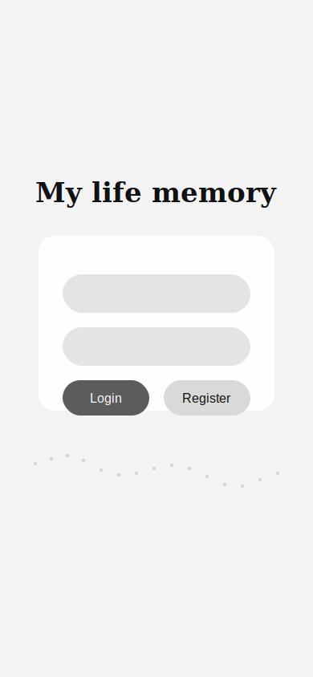
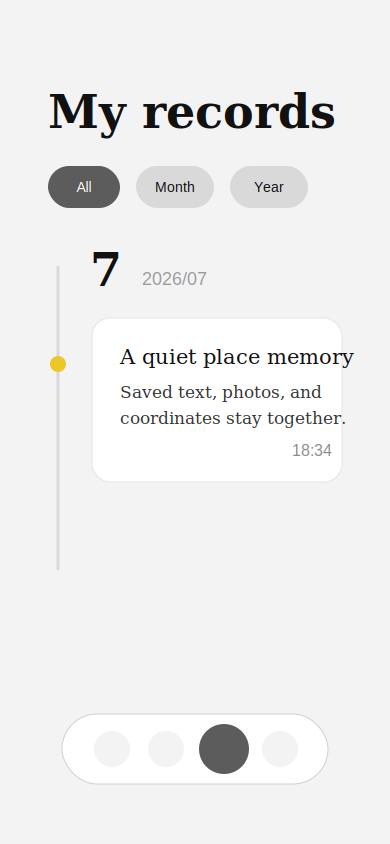

# My Life Memory

My Life Memory is a private life-map app for saving places, notes, photos, routes, coordinates, and travel statistics in one personal memory space.

## Screenshots

Screenshots are kept in `docs/screenshots/` after local or Pages preview capture.

| Login | Map | Records |
| --- | --- | --- |
|  |  |  |

## Features

- Place stars for meaningful locations by tapping the map, dragging the star tool, or importing the GPS metadata from one original photo.
- Tap a star to center it on the map, edit its notes, view and copy coordinates, or choose Apple Maps, AMap, Baidu Maps, or Google Maps for native map handoff.
- Write rich notes with text color, font size, underline, photos, camera capture, direct full-screen editing, and saved creation timestamps.
- Browse records by timeline, month/year filters, calendar markers, and a dedicated search results page that lists every matching note with match counts.
- Track adaptive movement routes, view route statistics, location rankings, star-colored bar charts, and a dotted world-map overview.
- Export a readable HTML memory report with note text, dates, coordinates, and embedded images instead of raw app-state JSON.
- Change the account password from the profile screen through Supabase Auth without storing readable passwords in app state.
- Sync per-user data with Supabase Auth, RLS-protected tables, and private Storage.
- Retry failed image deletions and clean unreferenced user media so deleted photos do not remain in cloud storage.
- Show an in-app user manual for map, record, statistics, account, icon, and permission behavior.

## Tech Stack

- React 19 + TypeScript
- Vite 6
- Tailwind CSS 4
- Leaflet + React Leaflet
- Motion for small UI transitions
- Supabase Auth, Postgres, Row Level Security, and private Storage
- Supabase Edge Functions for invite registration and the Memory API
- Local Model Context Protocol (MCP) server for AI clients
- GitHub Pages for static hosting

## Data And Storage

- Supabase Auth stores passwords and sessions.
- `profiles` stores account ID, nickname, and avatar path metadata.
- `app_states` stores stars, notes, routes, settings, and image metadata.
- `life-media` is a private Supabase Storage bucket for avatar and note image files.
- The frontend stores only Storage metadata in app state: `provider`, `bucket`, `path`, `mimeType`, `size`, and `createdAt`.
- Legacy compressed data URL images still render as fallback, but new uploads use Storage when Supabase is configured.
- Photo-GPS star creation uploads the selected photo through the same Storage flow, then creates a star and a note at the embedded photo coordinates. If the photo has no usable GPS metadata, no star is created.
- Deleting an avatar, note image, star, or note queues the related Storage object for deletion. Failed deletes are retried after login, focus, or network recovery.
- On login, the app scans only the current user's Storage folder and removes unreferenced media after a short grace window. It does not list or delete other users' files.
- Password-like fields are removed before saving cloud app state; password changes go through `supabase.auth.updateUser`.
- Readable export intentionally omits raw app state, settings internals, and password fields. It writes a local `.html` report for the user to keep or archive.

## Memory API And MCP

My Life Memory exposes a user-scoped Memory API through the Supabase Edge Function `memory-api`. The API reads the authenticated user's `app_states` row, reshapes it into memory-focused JSON, and never exposes service-role credentials to the frontend or MCP clients.

Supported read actions:

- `search_memories`
- `list_locations`
- `get_location_memory`
- `get_day_memory`
- `get_routes`
- `summarize_memory_range`
- `export_memory_report`

Supported write/delete actions are present for future use:

- `create_star`
- `update_star`
- `add_note_to_star`
- `update_note`
- `delete_note`
- `delete_star`
- `delete_route`

Write actions require `confirmWrite: true`. Delete actions additionally require `confirm: "DELETE"` and remove referenced private Storage media only inside the current user's folder.

The local MCP server wraps this API for AI apps:

```sh
npm run mcp:memory
```

MCP environment variables:

```bash
MLM_SUPABASE_URL=https://your-project-ref.supabase.co
MLM_SUPABASE_ANON_KEY=your-publishable-or-anon-key
MLM_ACCOUNT=your-account-id
MLM_PASSWORD=your-password
```

You can use `MLM_SUPABASE_ACCESS_TOKEN` instead of `MLM_ACCOUNT` and `MLM_PASSWORD` if an AI client or helper has already obtained a user token.

By default, MCP exposes only read-only tools. To expose write tools locally:

```bash
MLM_MCP_ENABLE_WRITES=true
```

To expose destructive delete tools as well:

```bash
MLM_MCP_ENABLE_WRITES=true
MLM_MCP_ENABLE_DELETES=true
```

## Local Development

Prerequisite: Node.js 20 or newer is recommended.

```sh
npm install
cp .env.example .env.local
npm run dev
```

Open [http://localhost:3000/](http://localhost:3000/).

`.env.local` needs:

```bash
VITE_SUPABASE_URL=https://your-project-ref.supabase.co
VITE_SUPABASE_ANON_KEY=your-publishable-or-anon-key
```

## Supabase Setup

1. Create a Supabase project.
2. In Authentication settings, disable public Email signup after the invite function is deployed, so new users cannot bypass the invite flow with the anon key.
3. Open SQL Editor and run `supabase/schema.sql`.
4. Confirm these objects exist:
   - `public.profiles`
   - `public.app_states`
   - private Storage bucket `life-media`
   - RLS policies for both tables and `storage.objects`
5. Deploy the Supabase Edge Functions `register-with-invite` and `memory-api`.
6. Store the invite code only as the Edge Function secret named `INVITE_CODE`. Do not put the code in frontend env vars, source files, README examples, localStorage, app state, or export data.
7. The function also requires Supabase server environment variables `SUPABASE_URL` and `SUPABASE_SERVICE_ROLE_KEY`.
8. If permissions look wrong, run `supabase/verify-cloud-backend.sql` to inspect the project.
9. If table grants are missing, run `supabase/fix-permissions.sql`.

Storage paths are user scoped:

```text
authUserId/notes/noteId/imageId.jpg
authUserId/avatars/profile/imageId.jpg
```

## Deployment

For GitHub Pages:

1. Add production Supabase env vars to the build environment.
   - `VITE_SUPABASE_URL`
   - `VITE_SUPABASE_ANON_KEY`
2. Run:

   ```sh
   npm run build
   ```

3. Publish `dist/` to the Pages branch or use `.github/workflows/deploy-pages.yml`.
4. After deploy, open the Pages URL and test:
   - register and log in
   - switch accounts on the same device and confirm each account sees only its own data
   - upload an avatar
   - add a note image
   - create a star from a photo with GPS metadata
   - search note text and open a result from the search results page
   - change the password from the profile screen
   - export a readable HTML report
   - call `memory-api` with a logged-in user's bearer token
   - start the local MCP server and list read-only tools
   - reload on another device/browser
   - delete the image and confirm it disappears

## Security Notes

- Do not commit `.env.local`, service role keys, database passwords, or raw SQL connection strings.
- The frontend must use only the Supabase publishable/anon key.
- `service_role` belongs only in trusted server environments and is not needed for this app.
- Registration is gated by the Supabase Edge Function `register-with-invite`; existing accounts log in normally and do not need an invite code.
- The `memory-api` Edge Function must authenticate a real user bearer token before reading or changing app state.
- The MCP server logs in as one normal user or uses one user access token; it does not use service-role credentials.
- MCP write/delete tools are hidden unless explicitly enabled by local environment variables.
- The invite code must live only in Supabase Function Secrets as `INVITE_CODE`.
- After deployment, disable public Supabase Email signup so registration cannot bypass the Edge Function.
- RLS ensures users can read/write only their own profile, app state, and Storage objects.
- Private images are rendered with short-lived signed URLs; signed URLs are not stored in app state.
- App state sanitization strips password-like fields before cloud save.
- Supabase Auth passwords cannot be viewed by the app. The app supports changing passwords, not revealing saved passwords.
- Media cleanup is user scoped by the authenticated user UUID folder, for example `authUserId/notes/noteId/imageId.jpg`.
- Legacy data URL images are kept only as compatibility fallback. They should not be used as the long-term storage path for new media.
- If GitHub Pages is used as a live demo, configure Supabase environment variables in GitHub Actions secrets before building.

## Useful Scripts

```sh
npm run dev
npm run mcp:memory
npm run lint
npm run build
```

## License

Apache License 2.0. See [LICENSE](LICENSE).
